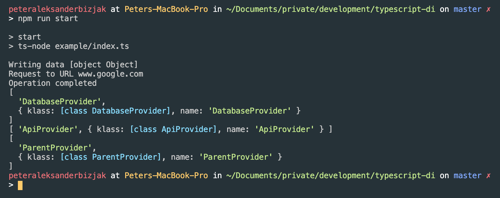

# TypeScript DI

Simple TypeScript library showcasing dependency injection functionalities. Heavily inspired by [this project](https://github.com/nehalist/di-ts).

### Usage

Idea is to archive something like this

```ts
import { Injectable, Injector, retrieveStore } from '../src';

@Injectable()
export class DatabaseProvider {
    create(data: Record<string, unknown>): void {
        console.log(`Writing data ${data}`);
    }
}

@Injectable()
export class ApiProvider {
    request(url: string): void {
        console.log(`Request to URL ${url}`);
    }
}

@Injectable()
export class ParentProvider {
    constructor(
        private readonly databaseProvider: DatabaseProvider,
        private readonly apiProvider: ApiProvider
    ) { }

    operation(data: Record<string, unknown>, url: string): void {
        this.databaseProvider.create(data);
        this.apiProvider.request(url);
        console.log('Operation completed');
    }
}

const parent = Injector.resolve<ParentProvider>(ParentProvider);
parent.operation(
    {
        url: 'www.google.com',
        reason: 'searched for something'
    },
    'www.google.com'
);
```

while also keeping store of all dependencies

```ts
const store: Record<string, any> = retrieveStore();
Object.entries(store).forEach((entry) => console.log(entry));
```

Install dependencies (`npm install`) and use `npm run start` to run the example above, which should give the following output:



### License

Licensed under [MIT](LICENSE) license.